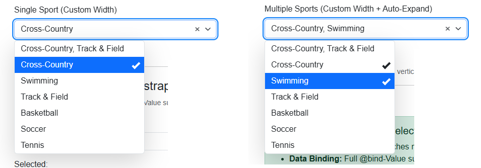

# BlazorBootstrapCustomControls

Razor Class Library providing **BlazorBootstrapSelectSingle** and **BlazorBootstrapSelectMulti**: Bootstrap 5–compatible, input-style single- and multi-select dropdowns. Behavior and styling follow the requirements specification below (§1–§12).

In short, this library provides dropdown controls that look and behave the same to the user, regardless if they are being asked to select zero, one, or multiple items.



**Live Demo:** See it in action [here](https://miesch1.github.io/BlazorBootstrapCustomControls/).

---

## Requirements

- **.NET 10** (or compatible)
- **Bootstrap 5 CSS** — the **host app** must reference Bootstrap 5 CSS (e.g. `bootstrap.min.css`). The components use Bootstrap form classes (`form-control`, `form-label`) and CSS variables (`--bs-*`). **Note:** Bootstrap CSS is required regardless of whether you use Blazor.Bootstrap or not; Blazor.Bootstrap does not bundle Bootstrap CSS.
- **No Blazor Bootstrap dependency** — while orginally intended to be used with the Blazor.Bootstrap library, this library has no dependency on Blazor.Bootstrap. It works with any Blazor Web App that uses Bootstrap 5 CSS, whether or not Blazor.Bootstrap is also used elsewhere in the app.

---

## Usage

1. Add a project reference to `BlazorBootstrapCustomControls`.
2. Ensure the app loads Bootstrap 5 CSS before (or with) the app's own styles.
3. The RCL's `bootstrap-select.css` and `bootstrap-select.js` are served from `_content/BlazorBootstrapCustomControls/`; reference them in the app (e.g. in `App.razor` or `index.html`):

   ```html
   <link href="_content/BlazorBootstrapCustomControls/css/bootstrap-select.css" rel="stylesheet" />
   ...
   <script src="_content/BlazorBootstrapCustomControls/js/bootstrap-select.js"></script>
   ```

4. Add `@using BlazorBootstrapCustomControls.Components.Shared` (or in `_Imports.razor`).
5. Use the components:

   ```razor
   <BlazorBootstrapSelectSingle TItem="MyItem" Data="@items"
       TextField="x => x.Name" ValueField="x => x.Id"
       PlaceholderText="-- Select --" @bind-Value="@selected" />

   <BlazorBootstrapSelectMulti TItem="MyItem" Data="@items"
       TextField="x => x.Name" ValueField="x => x.Id"
       PlaceholderText="-- Select --" @bind-Value="@selectedMany" />
   ```

---

## Development (sample app)

When running **BlazorBootstrapCustomControlsApp** via `dotnet watch run` or F5, the app uses **http://localhost:5175** and **https://localhost:7240**. If you **rebuild** while the app is still running, you may see *"port is already in use"* because the previous process is still holding those ports.

**Avoiding the conflict:**

- **Stop before rebuild:** Stop the running app (Ctrl+C in the `dotnet watch` terminal, or Shift+F5 if debugging) before doing a full **Rebuild**.
- **Prefer Build over Rebuild:** Use **Build** when possible; `dotnet watch` already rebuilds on changes. Use **Rebuild** only when you need a clean build.

**If the port is already in use:**

- Run `.\scripts\kill-dev-ports.ps1` from the repo root to terminate processes listening on 5175 and 7240, then start the app again.

---

## Contents

- **Components:** `BlazorBootstrapSelectSingle`, `BlazorBootstrapSelectMulti`, shared base and markup.
- **Styles:** `wwwroot/css/bootstrap-select.css` — form-control–like input, dropdown, check-marks, focus, dark-mode–friendly variables.
- **Scripts:** `wwwroot/js/bootstrap-select.js` — keyboard navigation, click-outside, focus handling.

---

## Requirements Specification

This section documents the complete functional and visual requirements that this library implements. The spec is **Bootstrap compatible** (Bootstrap 5 CSS variables, form patterns, and styling) and **library-agnostic**—it can be implemented with any Blazor dropdown or JS-based component.

---

### 1. Component Overview

| Component        | Type          | Value Type  | Description                                |
|------------------|---------------|-------------|--------------------------------------------|
| **SelectSingle** | Single-select | `string?`   | One item selectable; re-selecting clears unless de-selection is prevented.  |
| **SelectMulti**  | Multi-select  | `string[]?` | Multiple items; re-selecting clears; comma-separated in the input.  |

Both share: generic `TItem`, `TextField` / `ValueField` mapping, `Label`, `PlaceholderText`, `Width`, `Disabled`, `ShowClearButton`, and optional `ValidationMessage`.

In this spec, **control** means the whole SelectSingle or SelectMulti component; **input** means the focusable value-display part of the control.

Implementations must support **data binding** (e.g. `Value`/`ValueChanged` or `@bind-Value` / `@bind-Value:event` or equivalent). Prefer **C# in Razor** over JavaScript when implementing; use JS only when necessary (e.g. keydown before Blazor can handle it, or focus in a portal).

---

### 2. Identical Dropdown Behavior (Single vs Multi)

Single and multi selects must behave the same except where noted:

- Same dropdown styling (border, radius, shadow, alignment).
- Same dropdown-arrow styling and placement on the right.
- Same list item layout: text plus right-aligned check-mark for selection.
- Same highlight behavior for focus and hover (blue).
- Same keyboard behavior for opening, moving, and (where applicable) selecting.
- Selection only on mouse click or Enter (while the item is highlighted); not on hover, arrow-key movement, or any other interaction.

---

### 3. Bootstrap Compatibility

Implementations must work within a **Bootstrap 5** (or compatible) stylesheet:

- **Colors:** Use Bootstrap CSS variables: `--bs-primary` for the highlight background; `--bs-border-color` for dropdown borders; `--bs-secondary` or `--bs-body-color` for the dropdown arrow.
- **Forms:** Labels and control sizing should match Bootstrap form conventions (e.g. `.form-label` for labels; control height and border radius consistent with `.form-control`).
- **No Bootstrap JS:** The spec does not require Bootstrap's JavaScript; the dropdown may be implemented with any UI library or custom code.

---

### 4. Keyboard Behavior

#### 4.1 Open list — Down / Right / Enter

- **Both controls:** with focus in the **input** and the list **closed**, **Down**, **Right**, or **Enter** **open** the list. These keys do **not** close the list.
- When **Down** or **Right** opens the list, the **first** item is highlighted.
- When **Enter** opens the list, no item is highlighted initially.
- **Down**, **Right**, and **Enter** must **not** change the selected value(s) (e.g. must not cycle through options in the input).

#### 4.2 Close list — ArrowUp / ArrowLeft

- **Both controls:** when the list is **open** and the highlight is on the **first** item, **ArrowUp** and **ArrowLeft** **close** the list.

#### 4.3 Move highlight in list — ArrowUp / ArrowDown / ArrowLeft / ArrowRight

- When the list is **open** (no wrap):
  - **ArrowDown** and **ArrowRight**: move highlight to the **next** item; if on the **last** item, do nothing.
  - **ArrowUp** and **ArrowLeft**: move highlight to the **previous** item; when on the **first** item, they **close the list** (§4.2) instead of moving.
- **Right** behaves identically to **Down**; **Left** behaves identically to **Up**.
- Arrow keys **only move the highlight**; they do **not** select. Selection requires **Enter** (§4.4) or **mouse click** (§5).
- Highlight must use the same blue style as hover (see §7).
- **Both controls:** moving with these arrows must **not** change the selection (must not add, remove, or change the selected value) until the user presses Enter or clicks.

#### 4.4 Select or deselect focused item — Enter

- **Enter** on the focused/highlighted list item:
  - If the item is **not selected:** **selects** it. This is one of the two ways to select (the other is mouse click, §5).
    - **SelectSingle:** select **and close** the list.
    - **SelectMulti:** select **and leave the list open**.
  - If the item is **already selected:** **deselects** it, with the same behavior as clicking the selected item (§5):
    - **SelectSingle:** when de-selection is **allowed** (`AllowDeselect` true), deselect (clear value) and close; when de-selection is **prevented** (`AllowDeselect` false), no-op.
    - **SelectMulti:** deselect (toggle); list stays open.

#### 4.5 Close list; move focus away and close — Escape; Tab / Shift+Tab

- **Escape:** must close the list.
- **Tab / Shift+Tab:** move focus away and close the list.

---

### 5. Mouse Behavior

#### 5.1 Open or close list — click input

- **Both controls:** **click** on the **input** **toggles** the list (open if closed, close if open).

#### 5.2 Select or deselect — click list item

- **Selection occurs only when:** (1) the list item is **clicked**, or (2) **Enter** is pressed while the item is highlighted (§4.4). Hover and arrow-key movement do **not** select.
- **Click** list item (not selected): **select** it.
  - **SelectSingle:** select **and close** the list.
  - **SelectMulti:** select **and leave the list open**.
- **Click** list item (already selected), or **Enter** on the selected item (§4.4): **deselect** it.
  - **SelectSingle:** when de-selection is **allowed** (`AllowDeselect` true), deselect (clear value) and close; when de-selection is **prevented** (`AllowDeselect` false), no-op.
  - **SelectMulti:** deselect (toggle); list stays open.

#### 5.3 Highlight only; no selection — hover list item

- **Hover** over a list item: show blue highlight only; no selection.

---

### 6. Multi-Select–Specific

#### 6.1 Display of selected values

- In the **input**, show selected items as a **comma-separated** list (e.g. `"Cross-Country, Swimming, Track & Field"`).
- **Delimiter:** comma plus space: `", "`.

#### 6.2 List behavior

- Selected items **remain in the list** (not removed or hidden).
- List **stays open** after each selection so the user can pick several in a row.

---

### 7. Visual: Highlight and Selection

#### 7.1 Selection — right-aligned check-mark

- **Selection** is shown only by a **right-aligned check-mark** (✓-style), not by a background color.
- Check-mark: small, `rotate(45deg)`-style "check" (e.g. `0.5em × 1em`, border-based). **Check-mark color:** the same as the list item's text color (e.g. `currentColor` or inherit).
- **Selected rows must not have a blue (or other) highlight**; they stay neutral; selection = check-mark only.

#### 7.2 Focus / hover — blue highlight

- **Focus** (keyboard) and **hover** (mouse):
  - Background: `var(--bs-primary, #0d6efd)` (or theme primary).
  - **Text and check-mark:** both **white** while the item is highlighted.
- When focus or hover **leaves** the item, text and check-mark are **restored** to their normal colors (text = default; check-mark = same as text per §7.1).
- This applies to:
  - Items that are **focused** via keyboard (e.g. `:focus` / `:focus-within` or a custom class used for arrow-key highlight).
  - Items under `:hover`.
- **Selected + hover:** still show blue highlight with white text and white check-mark (same as non-selected hover); restore on leave.

#### 7.3 Identical highlight for keyboard and mouse

- The **same** blue style must be used for:
  - Keyboard-driven focus (including arrow-key movement in the list).
  - Mouse hover.
- No different colors or styles for "keyboard focus" vs "hover."

#### 7.4 Focus ring on input

- A **focus ring** (e.g. Bootstrap focus styles: border highlight, box-shadow) must **remain on the input** for the whole time the user is interacting with the control—whether they are interacting with the **input** itself or with the **open dropdown list**.
- When the list is open, the user may hover over list items or move the keyboard highlight (e.g. Down/Up arrow) within the list. In all cases, the **input retains focus** and thus the focus ring; list items receive **highlight only** (blue background per §7.2–§7.3), not DOM focus.
- The input must not lose focus when the list opens or when the user hovers or arrows within the list.

---

### 8. Layout and Styling

#### 8.1 List items

- **Single-select (custom item template):**
  - Structure: a container (e.g. with `data-value`) for the display text and an optional `.check-mark` when selected. Right padding (~40px) for the check-mark so the text does not overlap.

#### 8.2 Multi-select

- When no custom item template is used (or when a template is not desired):
  - Add right padding for the check-mark.
  - Use CSS `::after` (or equivalent) to draw the check-mark on the selected state (e.g. `[aria-selected="true"]` or the control's selected state).

#### 8.3 Dropdown

- Same for single and multi: border `var(--bs-border-color, #dee2e6)`, `border-radius` compatible with Bootstrap (e.g. `0.375rem`), `box-shadow` for elevation (e.g. `0 16px 48px rgba(0,0,0,0.175)`).
- Vertical offset (e.g. `margin-top: 4px`) so the list aligns with the control and has room for the focus ring.
- **Dynamic width:** The dropdown sizes to fit its content (largest item + padding + check-mark space), with a minimum width of `var(--bs-dropdown-min-width, 10rem)` to avoid tiny dropdowns.

#### 8.4 Dropdown arrow

- Same icon and color for single and multi: `var(--bs-secondary-color, #6c757d)` or `var(--bs-body-color)`.
- Arrow on the right, not hidden or overlapped.
- Uses Bootstrap's `--bs-form-select-bg-img` variable for dark mode support.

#### 8.5 Input overflow

- When the displayed text (single value or comma‑separated multi values) **exceeds the input width**, it is **truncated** with an ellipsis (`...`). The control does not grow vertically by default.
- An optional `AutoExpandVertically` parameter (see §9) allows the input to **wrap** and **grow vertically** when overflow would occur (e.g. when `Width` is set or the control is in a narrow container).

---

### 9. API and Parameters

Implementations must support **data binding** (e.g. `Value`/`ValueChanged` or `@bind-Value`). The following parameters support binding and configuration.

#### SelectSingle

| Parameter         | Type                      | Description                          |
|------------------|---------------------------|--------------------------------------|
| `Label`          | `string?`                 | Label above the control.             |
| `PlaceholderText`| `string?`                 | Placeholder when empty.              |
| `Data`           | `IEnumerable<TItem>`      | Data source.                         |
| `TextField`      | `Func<TItem, string>?`    | Display text.                        |
| `ValueField`     | `Func<TItem, string>?`    | Value.                               |
| `Value`          | `string?`                 | Bound value.                         |
| `ValueChanged`   | `EventCallback<string?>`  | Notify value change.                 |
| `Width`          | `string?`                 | Control width.                       |
| `AutoExpandVertically` | `bool` (default false) | When true, input wraps and grows vertically when text exceeds width; otherwise overflow is truncated with ellipsis (§8.5). |
| `Disabled`       | `bool`                    | Disable control.                     |
| `ValidationMessage` | `Expression<Func<string?>>?` | For validation.                  |
| `AllowDeselect`  | `bool` (default true)     | When false, prevents de-selecting: re-click and clear do not clear the value.     |
| `ShowClearButton` | `bool` (default true)    | When true, shows a clear button (×) when a value is selected and `AllowDeselect` is true. |

#### SelectMulti

| Parameter         | Type                       | Description                          |
|------------------|----------------------------|--------------------------------------|
| `Label`          | `string?`                  | Label above the control.             |
| `PlaceholderText`| `string?`                  | Placeholder when empty.              |
| `Data`           | `IEnumerable<TItem>`       | Data source.                         |
| `TextField`      | `Func<TItem, string>?`     | Display text.                        |
| `ValueField`     | `Func<TItem, string>?`    | Value.                               |
| `Value`          | `string[]?`                | Bound value.                         |
| `ValueChanged`   | `EventCallback<string[]?>` | Notify value change.                 |
| `Width`          | `string?`                  | Control width.                       |
| `AutoExpandVertically` | `bool` (default false) | When true, input wraps and grows vertically when text exceeds width; otherwise overflow is truncated with ellipsis (§8.5). |
| `Disabled`       | `bool`                     | Disable control.                     |
| `ValidationMessage` | `Expression<Func<string[]?>>?` | For validation.                 |
| `ShowClearButton` | `bool` (default true)     | When true, shows a clear button (×) when one or more values are selected. |

---

### 10. Implementation Notes

- **Prefer C# in Razor over JS:** Favor C# in Razor over JavaScript when implementing behavior; use JS only when necessary (e.g. keydown before Blazor can handle it, or focus in a portal). See §1.
- **Down / Right / Enter to open list (§4.1), both controls:** When the input has focus and the list is closed, **Down**, **Right**, or **Enter** open the list (they do not close it) and must not change the selected value(s). When **Down** or **Right** opens the list, the **first** item is highlighted. When **Enter** opens the list, no item is highlighted initially. Use a stable marker (e.g. `data-select-single`, `data-select-multi`, or a wrapper class) so keydown (or equivalent) handling applies to the intended control(s).
- **Up to close list (§4.2), both controls:** When the list is open and the highlight is on the first item, **ArrowUp** and **ArrowLeft** close the list.
- **Click input to toggle list (§5.1), both controls:** Click on the input toggles the list (open if closed, close if open).
- Arrow keys do **not** wrap: **ArrowDown**/**ArrowRight** on the last item do nothing; **ArrowUp**/**ArrowLeft** on the first item close the list (§4.2).
- **Dropdown (portal or inline):** If the list is rendered in a portal, ensure `:focus` / `:focus-within` and any custom "keyboard highlight" class apply to the list item (or a focusable child) so the same Bootstrap primary style is used as for hover.
- **Multi-select:** When no custom item template is used, apply right padding and a CSS `::after` check-mark on the selected state.
- **Single-select, prevent de-selection:** When `AllowDeselect` is false, ignore re-click-on-selected and Enter-on-selected attempts to clear the value. Clear-button behavior when de-selection is prevented is optional (§11).
- **Lose focus — collapse list; click not lost:** When the control **loses focus** (e.g. **Tab** or **clicking away**), the list must **collapse** (close). When the loss of focus is due to a **click** (clicking away), the click must **not** be lost: e.g. if the user clicks a button while the list is open, the list closes **and** the button receives the click (is activated).
- **Dark mode support:** All colors use Bootstrap CSS variables (`--bs-body-bg`, `--bs-body-color`, `--bs-primary`, etc.) so the controls adapt to Bootstrap's dark mode theme automatically.
- **Accessibility:** Uses Bootstrap CSS variables for sizing (e.g. `--bs-body-line-height`) so controls scale correctly when users adjust font size or line height for accessibility.

---

### 11. FUTURE — Optional Behaviors

The following behaviors are **optional**. Implementations may omit them or defer them to a later revision. When implemented, they should follow the constraints given.

- **Clear button** (SelectSingle, SelectMulti): A button (e.g. ×) in the control that clears the selection in one action. **SelectSingle:** when de-selection is prevented (`AllowDeselect` false), hide the button or make it no-op. **SelectMulti:** clears all selected. A `ShowClearButton` (or equivalent) parameter may control visibility. **Note:** This is currently implemented; when clear button has focus and Enter is pressed, it should clear the selection (currently opens list).
- **Select-all** (SelectMulti): Optional header or action to select all items in the list (default off). A `ShowSelectAll` (or equivalent) parameter may control visibility.
- **Dropdown icon** (SelectMulti, or both): Optional icon (e.g. arrow on the right) so the control matches the single-select. When implemented, same styling as §8.4. **Note:** This is currently implemented for both Single and Multi.
- **Floating label** (SelectSingle, SelectMulti): Optional floating-label style for the control. A `FloatingLabel` (or equivalent) parameter may control it.
- **Search / filter** (both): Optional text filter in or above the list to narrow items. Not in the current required spec.
- **Grouping** (both): Optional group headers in the list to organize items. Not in the current required spec.

---

### 12. Reference Implementation

This library (`BlazorBootstrapCustomControls`) implements this specification:

| Purpose                    | Path                                                       |
|----------------------------|------------------------------------------------------------|
| Single-select component    | `Components/Shared/BlazorBootstrapSelectSingle.razor`      |
| Multi-select component     | `Components/Shared/BlazorBootstrapSelectMulti.razor`       |
| Shared base class          | `Components/Shared/BlazorBootstrapSelectBase.cs`           |
| Shared markup              | `Components/Shared/BlazorBootstrapSelectMarkup.razor`       |
| Keyboard handling          | `wwwroot/js/bootstrap-select.js`                           |
| Styles (check-mark, highlight, dropdown) | `wwwroot/css/bootstrap-select.css`              |

---

*This spec is implementation-agnostic and requires Bootstrap compatibility. It can be satisfied with any Blazor dropdown or JS-based component; this library is one implementation.*
