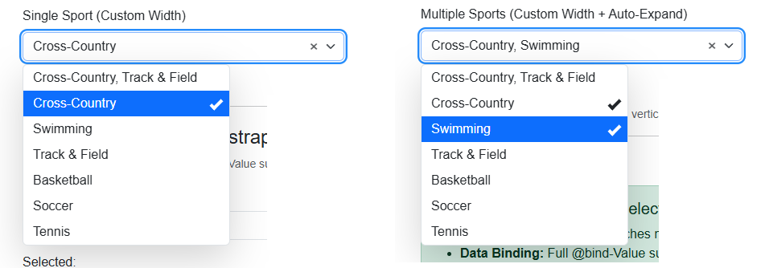

# BlazorBootstrapCustomControls

Razor Class Library providing **BlazorBootstrapSelectSingle** and **BlazorBootstrapSelectMulti**: Bootstrap 5–compatible, input-style single- and multi-select dropdowns. Behavior and styling follow the requirements specification below (§1–§12).

In short, this library provides dropdown controls that look and behave the same to the user, regardless if they are being asked to select zero, one, or multiple items.



**Live Demo:** See it in action [here](https://blazor.codingmatter.com/test-blazorbootstrap).

---

## Requirements

- **.NET 10** (or compatible)
- **Bootstrap 5 CSS** — the **host app** must reference Bootstrap 5 CSS (e.g. `bootstrap.min.css`). The components use Bootstrap form classes (`form-control`, `form-label`) and CSS variables (`--bs-*`). **Note:** Bootstrap CSS is required regardless of whether you use Blazor.Bootstrap or not; Blazor.Bootstrap does not bundle Bootstrap CSS.
- **No Blazor Bootstrap dependency** — while orginally intended to be used with the Blazor.Bootstrap library, this library has no dependency on Blazor.Bootstrap. It works with any Blazor Web App that uses Bootstrap 5 CSS, whether or not Blazor.Bootstrap is also used elsewhere in the app.

---

## Installation

Install from NuGet:

```bash
dotnet add package BlazorBootstrapCustomControls
```

---

## Usage

1. Add a project reference to `BlazorBootstrapCustomControls`.
2. Ensure the app loads Bootstrap 5 CSS before (or with) the app's own styles.
3. The RCL's `bootstrap-select.css` and `bootstrap-select.js` are served from `_content/BlazorBootstrapCustomControls/`; reference them in the app (e.g. in `App.razor` or `index.html`):

   ```html
   <link href="_content/BlazorBootstrapCustomControls/css/bootstrap-select.css" rel="stylesheet" />
   ...
   <script src="_content/BlazorBootstrapCustomControls/js/bootstrap-select.js"></script>
   ```

4. Add `@using BlazorBootstrapCustomControls.Components.Shared` (or in `_Imports.razor`).
5. Use the components:

   ```razor
   <BlazorBootstrapSelectSingle TItem="MyItem" TValue="string" Data="@items"
       TextField="x => x.Name" ValueField="x => x.Id"
       PlaceholderText="-- Select --" @bind-Value="@selected" />

   <BlazorBootstrapSelectMulti TItem="MyItem" TValue="string" Data="@items"
       TextField="x => x.Name" ValueField="x => x.Id"
       PlaceholderText="-- Select --" @bind-Value="@selectedMany" />

   <!-- Convenience wrappers for string-only data -->
   <BlazorBootstrapSelectSingleString Data="@names" @bind-Value="@selectedName" />
   <BlazorBootstrapSelectMultiString Data="@names" @bind-Value="@selectedNames" />
   ```

   Note: The components do not add default outer spacing. Use standard Bootstrap utility classes (e.g. `class="mb-3"`) or app-level CSS to control layout spacing.

---

## Generic API Overview

The core components are generic over both the **data item** and the **selected value**:

- `TItem`: the type in your `Data` collection (e.g., `Person`, `SportOption`).
- `TValue`: the type you want to bind to (e.g., `string`, `int`, `Guid`).

This allows you to keep your domain objects intact and just provide selectors:

- `TextField: Func<TItem, string>` — how to display each item in the UI
- `ValueField: Func<TItem, TValue>` — the value to bind and compare

Example:

```razor
<BlazorBootstrapSelectSingle TItem="Person" TValue="int"
    Data="@people"
    TextField="p => p.FullName"
    ValueField="p => p.Id"
    @bind-Value="@selectedPersonId" />
```

### Convenience wrappers

If your data is already `IEnumerable<string>`, you can skip selectors entirely:

```razor
<BlazorBootstrapSelectSingleString Data="@colors" @bind-Value="@selectedColor" />
<BlazorBootstrapSelectMultiString Data="@colors" @bind-Value="@selectedColors" />
```

These wrappers simply wire `TextField` and `ValueField` to `s => s` for you.

## Development (sample app)

When running **BlazorBootstrapCustomControlsApp** via `dotnet watch run` or F5, the app uses **http://localhost:5175** and **https://localhost:7240**. If you **rebuild** while the app is still running, you may see *"port is already in use"* because the previous process is still holding those ports.

**Avoiding the conflict:**

- **Stop before rebuild:** Stop the running app (Ctrl+C in the `dotnet watch` terminal, or Shift+F5 if debugging) before doing a full **Rebuild**.
- **Prefer Build over Rebuild:** Use **Build** when possible; `dotnet watch` already rebuilds on changes. Use **Rebuild** only when you need a clean build.

**If the port is already in use:**

- Run `.\scripts\kill-dev-ports.ps1` from the repo root to terminate processes listening on 5175 and 7240, then start the app again.

---

## Contents

- **Components:** `BlazorBootstrapSelectSingle`, `BlazorBootstrapSelectMulti`, shared base and markup.
- **Styles:** `wwwroot/css/bootstrap-select.css` — form-control–like input, dropdown, check-marks, focus, dark-mode–friendly variables.
- **Scripts:** `wwwroot/js/bootstrap-select.js` — keyboard navigation, click-outside, focus handling.

---

## Requirements Specification

This section documents the complete functional and visual requirements that this library implements. The spec is **Bootstrap compatible** (Bootstrap 5 CSS variables, form patterns, and styling) and **library-agnostic**—it can be implemented with any Blazor dropdown or JS-based component.

---

### 1. Component Overview

| Component        | Type          | Bound value (generic API) | Description                                |
|------------------|---------------|---------------------------|--------------------------------------------|
| **SelectSingle** | Single-select | `TValue?`                 | One item selectable; re-selecting clears unless de-selection is prevented.  |
| **SelectMulti**  | Multi-select  | `TValue[]?`               | Multiple items; re-selecting toggles; comma-separated in the input.  |

Implementations are **`BlazorBootstrapSelectSingle` / `BlazorBootstrapSelectMulti`** with type parameters **`TItem`** (items in `Data`) and **`TValue`** (bound value). **`BlazorBootstrapSelectSingleString`** and **`BlazorBootstrapSelectMultiString`** fix both to **`string`** and omit `TextField` / `ValueField` (they use identity mapping).

Both families share: `Label`, `PlaceholderText`, `Width`, `Disabled`, `ShowClearButton`, and optional `ValidationMessage` (types follow `TValue`; see §9).

In this spec, **control** means the whole SelectSingle or SelectMulti component; **input** means the focusable value-display part of the control.

Implementations must support **data binding** (e.g. `Value`/`ValueChanged` or `@bind-Value` / `@bind-Value:event` or equivalent). Prefer **C# in Razor** over JavaScript when implementing; use JS only when necessary (e.g. keydown before Blazor can handle it, or focus in a portal).

---

### 2. Identical Dropdown Behavior (Single vs Multi)

Single and multi selects must behave the same except where noted:

- Same dropdown styling (border, radius, shadow, alignment).
- Same dropdown-arrow styling and placement on the right.
- Same list item layout: text plus right-aligned check-mark for selection.
- Same highlight behavior for focus and hover (blue).
- Same keyboard behavior for opening, moving, and (where applicable) selecting.
- Selection only on mouse click or Enter (while the item is highlighted); not on hover, arrow-key movement, or any other interaction.

---

### 3. Bootstrap Compatibility

Implementations must work within a **Bootstrap 5** (or compatible) stylesheet:

- **Colors:** Use Bootstrap CSS variables: `--bs-primary` for the highlight background; `--bs-border-color` for dropdown borders; `--bs-secondary` or `--bs-body-color` for the dropdown arrow.
- **Forms:** Labels and control sizing should match Bootstrap form conventions (e.g. `.form-label` for labels; control height and border radius consistent with `.form-control`).
- **No Bootstrap JS:** The spec does not require Bootstrap's JavaScript; the dropdown may be implemented with any UI library or custom code.

---

### 4. Keyboard Behavior

#### 4.1 Open list — Down / Right / Enter

- **Both controls:** with focus in the **input** and the list **closed**, **Down**, **Right**, or **Enter** **open** the list. These keys do **not** close the list.
- When **Down** or **Right** opens the list, the **first** item is highlighted.
- When **Enter** opens the list, no item is highlighted initially.
- **Down**, **Right**, and **Enter** must **not** change the selected value(s) (e.g. must not cycle through options in the input).

#### 4.1a Type-ahead — printable keys (opens list when closed)

- **Both controls:** with focus in the **input**, **printable keys** (single character keys, excluding Ctrl/Alt/Meta modifiers) move the **keyboard highlight** to the **first list item** whose display text **starts with** the current type-ahead string (**case-insensitive** prefix match).
- **List closed:** the first such key **opens** the list and applies the same matching rules (highlight only; **no selection** until **Enter** or **mouse click**, §4.4 / §5).
- **List open:** each printable key **appends** to a short buffer; the highlight updates to the first prefix match. If the longer string matches nothing, the implementation retries using **only the latest character** (so a mistyped letter can still jump to a valid prefix).
- **Buffer reset:** the type-ahead string is cleared when it goes **idle** for about **700 ms** between keys, when the list **closes**, or when the list is opened by **clicking** the input (so mouse-open starts with a fresh buffer).
- **Selection:** typing alone does **not** change the bound value; the user still **Enter**s or **clicks** to confirm (§4.4, §5).

#### 4.2 Close list — ArrowUp / ArrowLeft

- **Both controls:** when the list is **open** and the highlight is on the **first** item, **ArrowUp** and **ArrowLeft** **close** the list.

#### 4.3 Move highlight in list — ArrowUp / ArrowDown / ArrowLeft / ArrowRight

- When the list is **open** (no wrap):
  - **ArrowDown** and **ArrowRight**: move highlight to the **next** item; if on the **last** item, do nothing.
  - **ArrowUp** and **ArrowLeft**: move highlight to the **previous** item; when on the **first** item, they **close the list** (§4.2) instead of moving.
- **Right** behaves identically to **Down**; **Left** behaves identically to **Up**.
- Arrow keys **only move the highlight**; they do **not** select. Selection requires **Enter** (§4.4) or **mouse click** (§5).
- Highlight must use the same blue style as hover (see §7).
- **Both controls:** moving with these arrows must **not** change the selection (must not add, remove, or change the selected value) until the user presses Enter or clicks.

#### 4.4 Select or deselect focused item — Enter

- **Enter** on the focused/highlighted list item:
  - If the item is **not selected:** **selects** it. This is one of the two ways to select (the other is mouse click, §5).
    - **SelectSingle:** select **and close** the list.
    - **SelectMulti:** select **and leave the list open**.
  - If the item is **already selected:** **deselects** it, with the same behavior as clicking the selected item (§5):
    - **SelectSingle:** when de-selection is **allowed** (`AllowDeselect` true), deselect (clear value) and close; when de-selection is **prevented** (`AllowDeselect` false), no-op.
    - **SelectMulti:** deselect (toggle); list stays open.

#### 4.5 Close list; move focus away and close — Escape; Tab / Shift+Tab

- **Escape:** must close the list.
- **Tab / Shift+Tab:** move focus away and close the list.

---

### 5. Mouse Behavior

#### 5.1 Open or close list — click input

- **Both controls:** **click** on the **input** **toggles** the list (open if closed, close if open).

#### 5.2 Select or deselect — click list item

- **Selection occurs only when:** (1) the list item is **clicked**, or (2) **Enter** is pressed while the item is highlighted (§4.4). Hover and arrow-key movement do **not** select.
- **Click** list item (not selected): **select** it.
  - **SelectSingle:** select **and close** the list.
  - **SelectMulti:** select **and leave the list open**.
- **Click** list item (already selected), or **Enter** on the selected item (§4.4): **deselect** it.
  - **SelectSingle:** when de-selection is **allowed** (`AllowDeselect` true), deselect (clear value) and close; when de-selection is **prevented** (`AllowDeselect` false), no-op.
  - **SelectMulti:** deselect (toggle); list stays open.

#### 5.3 Highlight only; no selection — hover list item

- **Hover** over a list item: show blue highlight only; no selection.

---

### 6. Multi-Select–Specific

#### 6.1 Display of selected values

- In the **input**, show selected items as a **comma-separated** list (e.g. `"Cross-Country, Swimming, Track & Field"`).
- **Delimiter:** comma plus space: `", "`.

#### 6.2 List behavior

- Selected items **remain in the list** (not removed or hidden).
- List **stays open** after each selection so the user can pick several in a row.

---

### 7. Visual: Highlight and Selection

#### 7.1 Selection — right-aligned check-mark

- **Selection** is shown only by a **right-aligned check-mark** (✓-style), not by a background color.
- Check-mark: small, `rotate(45deg)`-style "check" (e.g. `0.5em × 1em`, border-based). **Check-mark color:** the same as the list item's text color (e.g. `currentColor` or inherit).
- **Selected rows must not have a blue (or other) highlight**; they stay neutral; selection = check-mark only.

#### 7.2 Focus / hover — blue highlight

- **Focus** (keyboard) and **hover** (mouse):
  - Background: `var(--bs-primary, #0d6efd)` (or theme primary).
  - **Text and check-mark:** both **white** while the item is highlighted.
- When focus or hover **leaves** the item, text and check-mark are **restored** to their normal colors (text = default; check-mark = same as text per §7.1).
- This applies to:
  - Items that are **focused** via keyboard (e.g. `:focus` / `:focus-within` or a custom class used for arrow-key highlight).
  - Items under `:hover`.
- **Selected + hover:** still show blue highlight with white text and white check-mark (same as non-selected hover); restore on leave.

#### 7.3 Identical highlight for keyboard and mouse

- The **same** blue style must be used for:
  - Keyboard-driven focus (including arrow-key movement in the list).
  - Mouse hover.
- No different colors or styles for "keyboard focus" vs "hover."

#### 7.4 Focus ring on input

- A **focus ring** (e.g. Bootstrap focus styles: border highlight, box-shadow) must **remain on the input** for the whole time the user is interacting with the control—whether they are interacting with the **input** itself or with the **open dropdown list**.
- When the list is open, the user may hover over list items or move the keyboard highlight (e.g. Down/Up arrow) within the list. In all cases, the **input retains focus** and thus the focus ring; list items receive **highlight only** (blue background per §7.2–§7.3), not DOM focus.
- The input must not lose focus when the list opens or when the user hovers or arrows within the list.

---

### 8. Layout and Styling

#### 8.1 List items

- **Single-select (custom item template):**
  - Structure: a container (e.g. with `data-value`) for the display text and an optional `.check-mark` when selected. Right padding (~40px) for the check-mark so the text does not overlap.

#### 8.2 Multi-select

- When no custom item template is used (or when a template is not desired):
  - Add right padding for the check-mark.
  - Use CSS `::after` (or equivalent) to draw the check-mark on the selected state (e.g. `[aria-selected="true"]` or the control's selected state).

#### 8.3 Dropdown

- Same for single and multi: border `var(--bs-border-color, #dee2e6)`, `border-radius` compatible with Bootstrap (e.g. `0.375rem`), `box-shadow` for elevation (e.g. `0 16px 48px rgba(0,0,0,0.175)`).
- Vertical offset (e.g. `margin-top: 4px`) so the list aligns with the control and has room for the focus ring.
- **Dynamic width:** The dropdown sizes to fit its content (largest item + padding + check-mark space), with a minimum width of `var(--bs-dropdown-min-width, 10rem)` to avoid tiny dropdowns.

#### 8.4 Dropdown arrow

- Same icon and color for single and multi: `var(--bs-secondary-color, #6c757d)` or `var(--bs-body-color)`.
- Arrow on the right, not hidden or overlapped.
- Uses Bootstrap's `--bs-form-select-bg-img` variable for dark mode support.

#### 8.5 Input overflow

- When the displayed text (single value or comma‑separated multi values) **exceeds the input width**, it is **truncated** with an ellipsis (`...`). The control does not grow vertically by default.
- An optional `AutoExpandVertically` parameter (see §9) allows the input to **wrap** and **grow vertically** when overflow would occur (e.g. when `Width` is set or the control is in a narrow container).

---

### 9. API and Parameters

Implementations must support **data binding** with **`Value`**, **`ValueChanged`**, and **`@bind-Value`**. `ValueChanged` is always an **`EventCallback<…>`** carrying the new value (or `default` / empty array when cleared)—not `ChangeEventArgs` (see §10).

Parameters below match **`BlazorBootstrapSelectSingle`**, **`BlazorBootstrapSelectMulti`**, and the **`*String`** wrappers. Generic components use **`[Parameter(CaptureUnmatchedValues = true)]`** on `AdditionalAttributes`; the `*String` wrappers only forward declared parameters (no unmatched capture)—use the generic components if you need arbitrary extra attributes on the outer element.

#### BlazorBootstrapSelectSingle (`TItem`, `TValue`)

| Parameter         | Type                              | Description                          |
|------------------|-----------------------------------|--------------------------------------|
| `Label`          | `string?`                         | Label above the control.             |
| `PlaceholderText`| `string?`                         | Placeholder when empty.              |
| `Data`           | `IEnumerable<TItem>?`             | Data source.                         |
| `TextField`      | `Func<TItem, string>?`           | Display text per item.               |
| `ValueField`     | `Func<TItem, TValue>?`           | Bound value per item (required when `TItem` is not `TValue`; see base `GetValue`). |
| `Value`          | `TValue?`                         | Bound value.                         |
| `ValueChanged`   | `EventCallback<TValue?>`        | Fired with the new value after user action (never `ChangeEventArgs`). |
| `Class`          | `string?`                         | Additional CSS classes on the interactive surface (e.g. `\"is-invalid\"`). |
| `Width`          | `string?`                         | Control width (e.g. `300px`, `100%`). |
| `AutoExpandVertically` | `bool` (default false)    | When true, displayed text wraps vertically when it exceeds width (§8.5). |
| `DropdownMatchInputWidth` | `bool` (default false) | When true, dropdown width matches the input width. |
| `IsInvalid`      | `bool` (default false)          | Invalid visual state (Bootstrap-compatible). |
| `Disabled`       | `bool`                            | Disable control.                     |
| `InputAttributes`| `IDictionary<string, object>?`    | Splatted onto the combobox surface. `onchange` / `oninput` keys are omitted at render (§10). |
| `AdditionalAttributes` | `IDictionary<string, object>?` | Unmatched parameters / splat on the **outer** wrapper. Same stripping of `onchange` / `oninput` (§10). |
| `ValidationMessage` | `Expression<Func<TValue?>>?`     | For `ValidationMessage` / `EditForm`. |
| `AllowDeselect`  | `bool` (default true)             | When false, re-click and clear cannot clear the selection. |
| `ShowClearButton` | `bool` (default true)           | Clear button (×) when a value is selected and `AllowDeselect` is true. |
| `ItemTemplate` | `RenderFragment<SelectItemContext<TItem, TValue>>?` | Optional custom dropdown row (overrides default + convenience icon row). |
| `SelectedValueTemplate` | `RenderFragment<SelectItemContext<TItem, TValue>>?` | Optional custom selected-value surface (overrides plain text + convenience icon). |
| `SemanticField` | `Func<TItem, SelectSemantic>?` | Optional semantic for context + default chip. |
| `SemanticTextField` | `Func<TItem, string?>?` | Optional chip text; defaults to enum label when unset. |
| `IconContent` | `Func<TItem, string?>?` | Optional convenience icon content (ignored when `ItemTemplate` is set). |
| `IconAriaLabelField` | `Func<TItem, string?>?` | Optional accessible name; otherwise icon is decorative. |
| `IconRenderMode` | `SelectIconRenderMode` | `CssClass` (e.g. Bootstrap Icons) or `Text` (emoji/glyph). |
| `IconPlacement` | `SelectIconPlacement` | `Start` or `End` relative to label text. |
| `ShowIconInSelectedValue` | `bool` (default true) | Include convenience icon in combobox when not using `SelectedValueTemplate`. |
| `ShowSemanticPillInSelectedValue` | `bool` (default true) | Include semantic chip in combobox when not using `SelectedValueTemplate`. |

#### BlazorBootstrapSelectMulti (`TItem`, `TValue`)

| Parameter         | Type                               | Description                          |
|------------------|------------------------------------|--------------------------------------|
| `Label`          | `string?`                          | Label above the control.             |
| `PlaceholderText`| `string?`                          | Placeholder when empty.              |
| `Data`           | `IEnumerable<TItem>?`             | Data source.                         |
| `TextField`      | `Func<TItem, string>?`            | Display text per item.               |
| `ValueField`     | `Func<TItem, TValue>?`            | Bound value per item.                |
| `Value`          | `TValue[]?`                        | Bound selection.                     |
| `ValueChanged`   | `EventCallback<TValue[]?>`        | Fired with the new array (empty when cleared). Never `ChangeEventArgs`. |
| `Class`          | `string?`                          | Additional CSS classes on the interactive surface. |
| `Width`          | `string?`                          | Control width.                       |
| `AutoExpandVertically` | `bool` (default false)     | Same as single (§8.5).               |
| `DropdownMatchInputWidth` | `bool` (default false)  | Same as single.                      |
| `IsInvalid`      | `bool` (default false)           | Same as single.                      |
| `Disabled`       | `bool`                             | Disable control.                     |
| `InputAttributes`| `IDictionary<string, object>?`     | Same as single (stripping §10).      |
| `AdditionalAttributes` | `IDictionary<string, object>?` | Same as single.                      |
| `ValidationMessage` | `Expression<Func<TValue[]?>>?` | For validation.                      |
| `ShowClearButton` | `bool` (default true)            | Clear button when at least one value is selected. |
| `ItemTemplate` | `RenderFragment<SelectItemContext<TItem, TValue>>?` | Same as single. |
| `SelectedValueTemplate` | `RenderFragment<SelectItemContext<TItem, TValue>>?` | Same as single. |
| `SemanticField` | `Func<TItem, SelectSemantic>?` | Same as single. |
| `SemanticTextField` | `Func<TItem, string?>?` | Same as single. |
| `IconContent` | `Func<TItem, string?>?` | Same as single. |
| `IconAriaLabelField` | `Func<TItem, string?>?` | Same as single. |
| `IconRenderMode` | `SelectIconRenderMode` | Same as single. |
| `IconPlacement` | `SelectIconPlacement` | Same as single. |
| `ShowIconInSelectedValue` | `bool` (default true) | Same as single. |
| `ShowSemanticPillInSelectedValue` | `bool` (default true) | Same as single. |

#### BlazorBootstrapSelectSingleString

Thin wrapper: `TItem` and `TValue` are both **`string`**; `TextField` and `ValueField` are fixed to identity (`s => s`). Same parameters as **BlazorBootstrapSelectSingle** except:

| Parameter         | Type                      | Notes                                |
|------------------|---------------------------|--------------------------------------|
| `Data`           | `IEnumerable<string>?`    | Item list.                           |
| `Value`          | `string?`                 |                                      |
| `ValueChanged`   | `EventCallback<string?>`  | Equivalent to `EventCallback<TValue?>` with `TValue = string`. |
| `ValidationMessage` | `Expression<Func<string?>>?` |                                  |
| *(no)* `TextField`, `ValueField` | — | Omitted on the wrapper.          |
| *(no)* `AdditionalAttributes` capture | — | Use **BlazorBootstrapSelectSingle** for unmatched splat. |
| `InputAttributes`| `IDictionary<string, object>?` | Forwarded; stripping still applied inside the generic implementation. |
| *(also)* `ItemTemplate`, `SelectedValueTemplate`, `SemanticField`, `SemanticTextField`, `IconContent`, `IconAriaLabelField`, `IconRenderMode`, `IconPlacement`, `ShowIconInSelectedValue`, `ShowSemanticPillInSelectedValue` | — | Forwarded to **BlazorBootstrapSelectSingle** (`TItem`/`TValue` = `string`). |

#### BlazorBootstrapSelectMultiString

Same idea as **BlazorBootstrapSelectSingleString** for multi-select:

| Parameter         | Type                        | Notes                                |
|------------------|-----------------------------|--------------------------------------|
| `Data`           | `IEnumerable<string>?`      |                                      |
| `Value`          | `string[]?`                 |                                      |
| `ValueChanged`   | `EventCallback<string[]?>`  |                                      |
| `ValidationMessage` | `Expression<Func<string[]?>>?` |                               |
| *(no)* `TextField`, `ValueField` | — |                                      |
| *(no)* `AdditionalAttributes` capture | — | Use **BlazorBootstrapSelectMulti** for unmatched splat. |
| `InputAttributes`| `IDictionary<string, object>?` | Same as **BlazorBootstrapSelectSingleString**. |
| *(also)* `ItemTemplate`, `SelectedValueTemplate`, `SemanticField`, `SemanticTextField`, `IconContent`, `IconAriaLabelField`, `IconRenderMode`, `IconPlacement`, `ShowIconInSelectedValue`, `ShowSemanticPillInSelectedValue` | — | Forwarded to **BlazorBootstrapSelectMulti**. |

#### Item icon and pill API (templates vs convenience parameters)

Use **either** full templates **or** the optional **convenience icon** parameters. **If `ItemTemplate` / `SelectedValueTemplate` are set, they take precedence**; convenience `IconContent` is ignored for that surface.

| Parameter | Type | Description |
|---|---|---|
| `ItemTemplate` | `RenderFragment<SelectItemContext<TItem, TValue>>?` | Custom row markup for each dropdown item (full layout control). |
| `SelectedValueTemplate` | `RenderFragment<SelectItemContext<TItem, TValue>>?` | Custom markup for selected value(s) in the combobox. |
| `SemanticField` / `SemanticTextField` | see §9 tables | Default semantic chips + `SelectItemContext`. |
| `IconContent` | `Func<TItem, string?>?` | Low-code icon: CSS class string (`IconRenderMode = CssClass`, e.g. Bootstrap Icons) or text/emoji (`Text`). |
| `IconAriaLabelField` | `Func<TItem, string?>?` | Meaningful icons: supply a short label; otherwise icon is decorative (`aria-hidden`). |
| `IconRenderMode` | `SelectIconRenderMode` | `CssClass` → `<i class="...">`; `Text` → `<span>…</span>`. |
| `IconPlacement` | `SelectIconPlacement` | `Start` or `End` next to the item label. |
| `ShowIconInSelectedValue` / `ShowSemanticPillInSelectedValue` | `bool` | Toggle parts of the default selected-value row when not using `SelectedValueTemplate`. |

**When to use convenience parameters vs templates**

- **Convenience path:** one icon string per row, same layout everywhere (Bootstrap Icons, emoji). Fast to wire; keep icons decorative or set `IconAriaLabelField`.
- **Template path:** multiple badges, conditional markup, SVG/component icons, or row layouts that vary per item—use `ItemTemplate` / `SelectedValueTemplate` and read `SelectItemContext`.

**Reusing `SelectSemantic` styling outside the select (grids, labels, cards)**

The library maps semantics to **`status-chip` / `status-chip-*`** classes in `bootstrap-select.css`. Use **`SelectSemanticCss`** so grids and forms match the select’s default chips:

```razor
@using BlazorBootstrapCustomControls.Components.Shared

<span class="@SelectSemanticCss.GetChipClasses(model.Status)">@labelText</span>
```

- `GetChipModifierClass(SelectSemantic)` returns only the modifier (e.g. `status-chip-warning`).
- `GetChipClasses(SelectSemantic)` returns `status-chip status-chip-*` for a full badge.

**Consistency:** treat `SelectSemantic` as domain/UI-neutral data; **centralize** display mapping in `SelectSemanticCss` (or your own wrapper that delegates to it) so lists, selects, and detail views stay consistent.

**Reference:** define templates in `@code` (or a shared partial class)—avoid complex inline `RenderFragment` literals in markup (compiler limitations).

**Verification checklist (implementation review)**

1. **Template override:** With both `ItemTemplate` and `IconContent` set, list rows match `ItemTemplate` only; convenience icon does not appear.
2. **Convenience dropdown + selected:** With `IconContent` + `SemanticField` and no templates, dropdown rows and combobox surface show icon + text + chip (unless toggled off via `Show*` flags).
3. **CssClass mode:** `IconRenderMode.CssClass` with Bootstrap Icons requires the app to include Bootstrap Icons CSS; verify glyphs render.
4. **Text mode:** `IconRenderMode.Text` with emoji shows in list and selected area; screen reader gets text from `TextField` / options `aria-label`.
5. **Multi selected surface:** Multiple selections render comma-separated convenience segments when `SelectedValueTemplate` is null and `IconContent` is set.
6. **External chip:** A grid cell using `SelectSemanticCss.GetChipClasses` matches select chip colors for the same `SelectSemantic` value.

---

### 10. Implementation Notes

- **Prefer C# in Razor over JS:** Favor C# in Razor over JavaScript when implementing behavior; use JS only when necessary (e.g. keydown before Blazor can handle it, or focus in a portal). See §1.
- **Prerender / static SSR (issue #7):** In Blazor Web Apps with default interactive prerender, the control registers `BSSelect.init` only when `RendererInfo.IsInteractive` is true (after the interactive render). `DisposeAsync` calls `BSSelect.teardown` only if that registration ran, so disposal during the static prerender segment does not invoke JS interop or throw `InvalidOperationException`.
- **Item templates and accessibility:** `ItemTemplate` renders inside the existing `role="option"` container. Keep non-text visuals (icons/pills) decorative and ensure text remains available via `TextField` (type-ahead + accessibility). The control computes option `aria-label` from text + semantic text.
- **Down / Right / Enter to open list (§4.1), both controls:** When the input has focus and the list is closed, **Down**, **Right**, or **Enter** open the list (they do not close it) and must not change the selected value(s). When **Down** or **Right** opens the list, the **first** item is highlighted. When **Enter** opens the list, no item is highlighted initially. Use a stable marker (e.g. `data-select-single`, `data-select-multi`, or a wrapper class) so keydown (or equivalent) handling applies to the intended control(s).
- **Type-ahead (§4.1a), both controls:** When the list is **closed**, printable keys are forwarded to `OpenAndTypeAhead`; when **open**, to `HandleTypeAhead` (see `wwwroot/js/bootstrap-select.js`). Prefix matching uses each item’s display text (`TextField` / `ToString()`). Closing the list clears the buffer; scrollbar interaction remains as in issue #3 (dropdown `mousedown` default prevented in markup). **IME:** While composing (e.g. CJK input), `keydown` is ignored for type-ahead (`isComposing` / composition events).
- **Open-list keyboard handling:** Arrow keys, Enter, Escape, and Tab while the list is open are handled on the **input** `keydown` listener and forwarded to `HandleListKey` (focus stays on the input per §7.4); there is no separate `keydown` listener on the dropdown panel.
- **Up to close list (§4.2), both controls:** When the list is open and the highlight is on the first item, **ArrowUp** and **ArrowLeft** close the list.
- **Click input to toggle list (§5.1), both controls:** Click on the input toggles the list (open if closed, close if open).
- Arrow keys do **not** wrap: **ArrowDown**/**ArrowRight** on the last item do nothing; **ArrowUp**/**ArrowLeft** on the first item close the list (§4.2).
- **Dropdown (portal or inline):** If the list is rendered in a portal, ensure `:focus` / `:focus-within` and any custom "keyboard highlight" class apply to the list item (or a focusable child) so the same Bootstrap primary style is used as for hover.
- **Multi-select:** When no custom item template is used, apply right padding and a CSS `::after` check-mark on the selected state.
- **Single-select, prevent de-selection:** When `AllowDeselect` is false, ignore re-click-on-selected and Enter-on-selected attempts to clear the value. Clear-button behavior when de-selection is prevented is optional (§11).
- **Lose focus — collapse list; click not lost:** When the control **loses focus** (e.g. **Tab** or **clicking away**), the list must **collapse** (close). When the loss of focus is due to a **click** (clicking away), the click must **not** be lost: e.g. if the user clicks a button while the list is open, the list closes **and** the button receives the click (is activated).
- **Dark mode support:** All colors use Bootstrap CSS variables (`--bs-body-bg`, `--bs-body-color`, `--bs-primary`, etc.) so the controls adapt to Bootstrap's dark mode theme automatically.
- **Accessibility:** Uses Bootstrap CSS variables for sizing (e.g. `--bs-body-line-height`) so controls scale correctly when users adjust font size or line height for accessibility. When `Label` is set, the label uses `for` pointing at the combobox `id` (same stable id as `data-bs-select-id`). When the list is open, the combobox sets `aria-controls` to the listbox element’s `id` (`{id}-listbox`).
- **Data binding / attribute splat:** Use `Value` / `ValueChanged` or `@bind-Value` only. Do not splat `onchange` / `oninput` onto the control (or into `InputAttributes` / unmatched attributes): those are for native `<input>` elements and use `ChangeEventArgs`, which does not match this control’s typed callbacks. As a safeguard, the implementation strips `onchange`/`oninput` from copies used for render so mistaken copy-paste from input components does not attach those handlers to the div combobox.

---

### 11. FUTURE — Optional Behaviors

The following behaviors are **optional**. Implementations may omit them or defer them to a later revision. When implemented, they should follow the constraints given.

 - **Clear button** (SelectSingle, SelectMulti): A button (e.g. ×) in the control that clears the selection in one action. **SelectSingle:** when de-selection is prevented (`AllowDeselect` false), hide the button or make it no-op. **SelectMulti:** clears all selected. A `ShowClearButton` (or equivalent) parameter may control visibility. **Note:** This is currently implemented; the clear button is click-only (not focusable, same as the dropdown arrow), and when the input has focus and the clear button is shown, pressing **Delete** clears the selection.
- **Select-all** (SelectMulti): Optional header or action to select all items in the list (default off). A `ShowSelectAll` (or equivalent) parameter may control visibility.
- **Dropdown icon** (SelectMulti, or both): Optional icon (e.g. arrow on the right) so the control matches the single-select. When implemented, same styling as §8.4. **Note:** This is currently implemented for both Single and Multi.
- **Floating label** (SelectSingle, SelectMulti): Optional floating-label style for the control. A `FloatingLabel` (or equivalent) parameter may control it.
- **Search / filter** (both): Optional text filter in or above the list to narrow items. Not in the current required spec. (Distinct from **type-ahead** prefix highlight in §4.1a, which does not remove items from the list.)
- **Grouping** (both): Optional group headers in the list to organize items. Not in the current required spec.

---

### 12. Reference Implementation

This library (`BlazorBootstrapCustomControls`) implements this specification:

| Purpose                    | Path                                                       |
|----------------------------|------------------------------------------------------------|
| Single-select component    | `Components/Shared/BlazorBootstrapSelectSingle.razor`      |
| Multi-select component     | `Components/Shared/BlazorBootstrapSelectMulti.razor`       |
| Shared base class          | `Components/Shared/BlazorBootstrapSelectBase.cs`           |
| Shared markup              | `Components/Shared/BlazorBootstrapSelectMarkup.razor`       |
| Keyboard handling          | `wwwroot/js/bootstrap-select.js`                           |
| Styles (check-mark, highlight, dropdown) | `wwwroot/css/bootstrap-select.css`              |

Building the RCL copies `wwwroot/js/bootstrap-select.js` and `wwwroot/css/bootstrap-select.css` into `docs/_content/...` and `docs/wwwroot/_content/...` when a `docs` folder exists (keeps checked-in GitHub Pages mirrors aligned). Pre-compressed `*.gz` / `*.br` siblings under `docs/_content` (if present) come from **Blazor publish** static-asset compression and the CI step that copies `publish/wwwroot` into `docs`; they are not updated by that sync target.

---

*This spec is implementation-agnostic and requires Bootstrap compatibility. It can be satisfied with any Blazor dropdown or JS-based component; this library is one implementation.*
